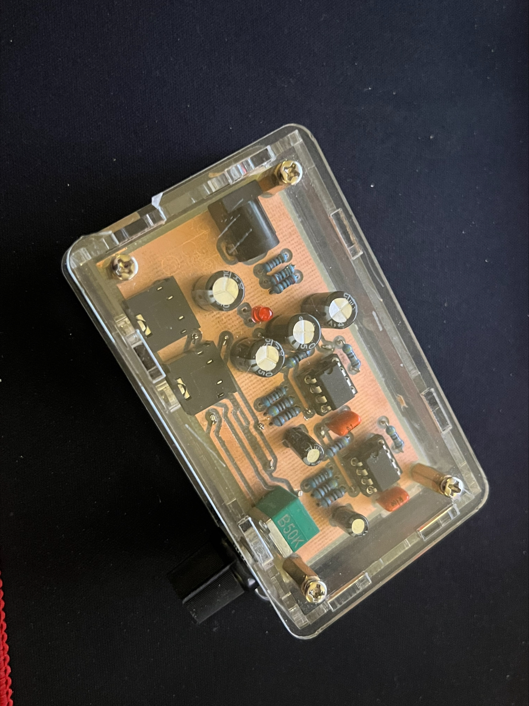
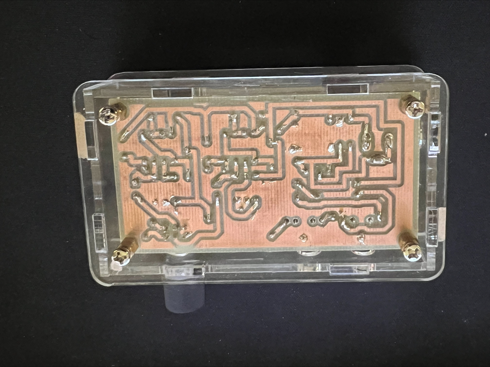
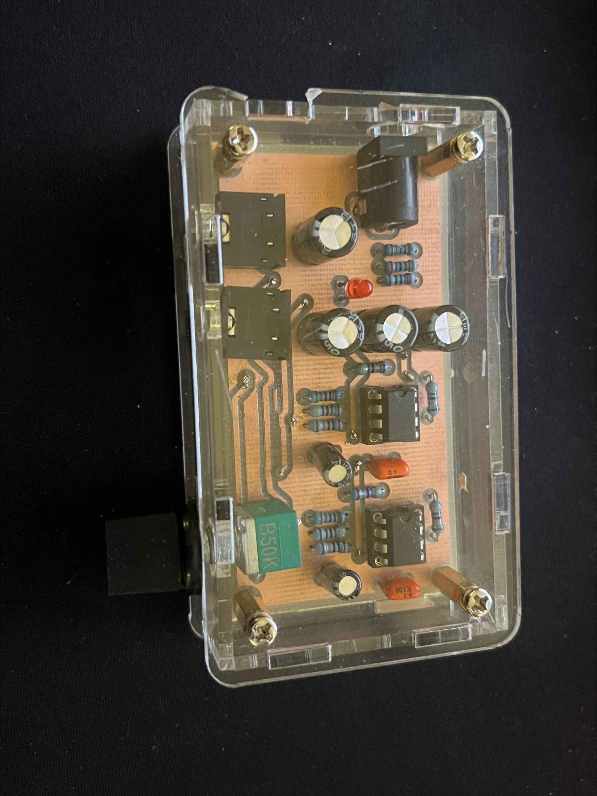
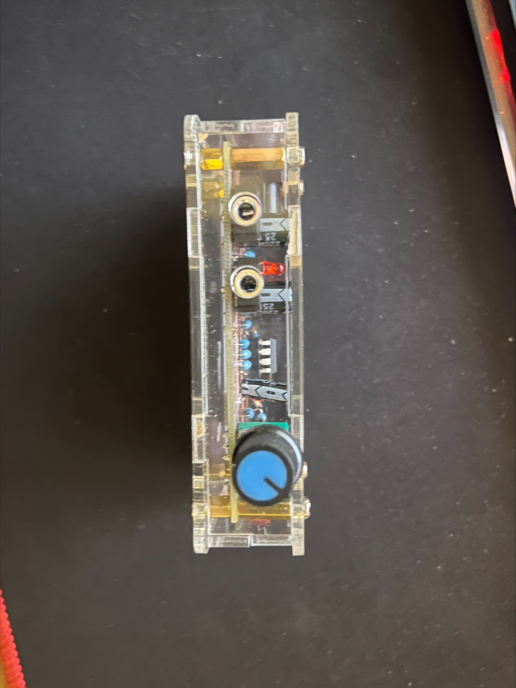

# Adjustable-Audio-Amplifier-PCB

This project features an adjustable audio amplifier PCB that I designed, etched, and soldered myself. The circuit is fully functional and successfully takes an input audio signal and provides an adjustable amplified output.

## 🛠️ Project Photos

---

## 📸 Board Previews
### 3D View

### PCB Layout

### Schematic

